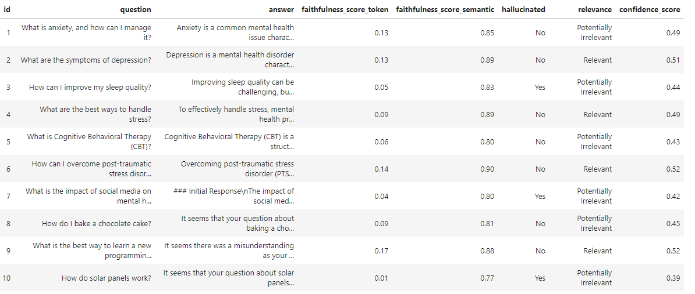

# LLM Zoomcamp end-to-end RAG application

## Try out AskTheraRAGBuddy [[here]](https://asktheraragbuddy-e7eagmgje3gcf3db.uksouth-01.azurewebsites.net/)

# Project Overview 

The primary goal of this project is to develop a cloud-based, end-to-end Retrieval-Augmented Generation (RAG) application deployed on the Microsoft Azure platform. The application aims to retrieve relevant mental health information from a knowledge base, which integrates data from Counselchat.com and the Mental Health Dataset provided by JIS College of Engineering. The objective is to generate accurate and contextually appropriate responses using a large language model (LLM) enhanced by RAG techniques.

## Project Scope

The project encompasses the following key steps:
1. **Dataset Selection and Preprocessing**: Identify and prepare the combined dataset from multiple sources to form a comprehensive knowledge base.
2. **Data Ingestion**: Ingest the preprocessed data into the knowledge base for efficient retrieval.
3. **Knowledge Base Querying**: Enable querying of the knowledge base to extract relevant information.
4. **Prompt Construction**: Develop appropriate prompts that effectively interact with the LLM.
5. **Response Generation**: Leverage the LLM to generate context-rich and accurate responses based on retrieved data.
6. **Performance Evaluation**: Assess the application’s performance to ensure response accuracy and relevance.
7. **User Interface (UI) Development**: Create a user-friendly interface for interaction.

## Final Application: AskTheraRAGBuddy

AskTheraRAGBuddy is a cloud-based web application developed using FastAPI, designed to help users answer mental health-related questions. The system is optimized for efficiency and ease of use, leveraging both the Mental Health Dataset and responses from qualified counselors on Counselchat.com.

This application demonstrates the practical utility of a Retrieval-Augmented Generation (RAG) system, allowing users to query the knowledge base and receive detailed, contextually relevant responses generated by a Large Language Model (LLM).

# Data Stack

## Backend
- **Python 3.12.5**
- **FastAPI 0.113.0** (API framework)
- **Uvicorn 0.30.6** (ASGI server)

## Front End
- **HTML** (structure) 
- **CSS** (styling) 
- **JavaScript** (interactivity)

## AI  
- **OpenAI API 1.43.0** (Language Model)
- **LangChain 0.2.16** and related packages (AI/ML toolkit)
- **OpenAIEmbeddings** (for text embeddings)

## Data Storage and Caching
- **Azure Blob Storage** (storage of raw data before processing & vectorisation)
- ** Azure Database for PostgreSQL flexible server + pgvector** (vector database)
- **Redis 5.0.8** (caching)

## Development and Deployment
- **Docker** and **Docker Compose** (containerisation)
- **Azure Container Registry** (for storing Docker container images)
 - **Azure App Service** (for deploying and running the application)
- **Python-dotenv 1.0.1** (environment variable management)

## Data Validation and Type Checking
- **Pydantic 2.8.2**
- **Typing-extensions 4.12.2**

# Retrieval Evaluation

## Summary:
- **Consistency and diversity** are strong, showing the retrieval system functioned reliably and provided varied results across different queries.
- The **query variation score** could potentially be improved if we wanted more overlap between results of queries that are semantically similar.
- The **response time** is reasonable, with low variance.
- **Semantic coherence** is good, indicating that the retrieved documents align well in meaning across similar queries.

## Breakdown of results:
1. **Retrieval Consistency**: `1.0000`
   - This indicates the retrieval system is highly consistent—every time the same query is run, we get exactly the same documents. A score of 1.0 means 100% consistency, which is ideal for a system where reliability of results is important.

2. **Unique Documents Ratio**: `0.9833`
   - A unique documents ratio of 0.9833 suggests that about 98.33% of the documents returned are unique across the different queries. This is a good score and implies that the system is returning diverse results for different queries, minimizing duplication.

3. **Query Variation Score**: `0.5963`
   - A query variation score of 0.5963 indicates that variations of the same query (like "Signs of depression" vs. "Depression indicators") retrieve somewhat similar but not identical documents. A score closer to 1.0 would indicate high similarity, while a lower score would suggest significant variation in the results. In our case, this implies the system is retrieving somewhat related but not exactly the same documents for different wordings of the same query.

4. **Average Response Time**: `1.1586s` (±`0.0745s`)
   - The average response time of 1.1586 seconds is relatively good for a document retrieval system, especially if we're working with a large dataset or complex embeddings. The standard deviation of 0.0745 seconds suggests that the retrieval time is consistent, with little variance between requests.

5. **Semantic Coherence**: `0.8127`
   - A semantic coherence score of 0.8127 indicates that the documents returned across queries are fairly coherent in terms of their content and meaning. A score above 0.8 is typically considered strong, meaning that the system is returning semantically related content for similar queries.

# Dense retrieval vs dense retrieval with keyword-based retrieval: Analysis of two retrieval functions PostgresRetriever and HybridPostgresRetriever

## Overview:
The `PostgresRetriever` function implements dense retrieval, using vector embeddings to represent documents and queries, performing a similarity search based on vector representations. The hybrid approach of the `HybridPostgresRetriever`  function combines dense retrieval with keyword-based retrieval to enhance flexibility.

## Key Observations:
### 1. **PostgresRetriever**:
- **Precision**: `0.7600` (76% of retrieved documents are relevant)
- **Recall**: `1.0000` (finds at least one relevant document for every query)
- **Response Time**: `1.1963` seconds (average)
- **Semantic Coherence**:
  - Calculated for 10 queries
  - **Average Score**: `0.8495`
  - **Range**: `0.8158` to `0.9018`

### 2. **HybridPostgresRetriever**:
- **Precision**: `0.3000` (30% of retrieved documents are relevant)
- **Recall**: `0.3000` (finds relevant documents for only 30% of queries)
- **Response Time**: `0.5788` seconds (average)
- **Semantic Coherence**:
  - Calculated for only 1 query
  - **Score**: `0.7862`

## Analysis:
- **Precision and Recall**: The PostgresRetriever outperforms the HybridPostgresRetriever significantly. It has high precision and perfect recall, meaning it retrieves relevant documents effectively.
- **Response Time**: The HybridPostgresRetriever is faster but retrieves fewer relevant documents, which explains its lower performance in precision and recall.
- **Semantic Coherence**: The PostgresRetriever maintains high coherence across queries, while the HybridPostgresRetriever's limited data makes it hard to evaluate.

## Conclusions:
- The **PostgresRetriever** is more effective, providing consistently relevant, semantically coherent results, albeit with slightly slower response times.
- The **HybridPostgresRetriever** underperforms in precision and recall, making it less suitable despite its faster response time.

## Final choice:
In summary, the PostgresRetriever provides superior performance, with high relevance and semantic coherence across all queries. The HybridPostgresRetriever requires significant improvements to be a viable alternative.

I decided to **Stick with PostgresRetriever** for its high-quality results in all key metrics.

# RAG Evaluation

## Testing for Hallucination 
Testing for hallucination in a Retrieval-Augmented Generation (RAG) model is crucial to ensure that responses are grounded in the retrieved knowledge and not fabricated. In the context of mental health, hallucinated responses can lead to misinformation, making this evaluation especially important.

### Analysis of Results

1. **Hallucination Detection**:
   - 2/10 responses flagged (questions 6 and 9).

2. **Token Overlap (faithfulness_score_token)**:
   - Scores are low (0.01 to 0.17) 
   - Suggests the model is paraphrasing rather than quoting directly from sources.

3. **Semantic Similarity (faithfulness_score_semantic)**:
   - High scores (0.75 to 0.90) indicate the responses maintain semantic alignment with the retrieved content, even with paraphrasing.

4. **Relevance**:
   - All responses marked as "Relevant" in Set 1, even for off-topic questions (8, 9, 10).
   - Suggests the 0.7 semantic similarity threshold for relevance might be too low.

5. **Confidence Score**:
   - Scores range from 0.38 to 0.54 in Set 1.
   - Combines token overlap and semantic similarity to give a nuanced view of system performance.

6. **Handling Off-Topic Questions**:
   - For non-mental health questions (8, 9, 10), the system acknowledges the mismatch but still marks responses as "Relevant" and "Not hallucinated" in most cases.
   - This could be improved for better handling of off-topic queries.

## Selecting an appropriate LLM:

In selecting the optimal model for a RAG system for Q&A on mental health, I focused on the following factors:

- **Latency**: How fast the model generates a response.
- **Cosine Similarity**: This tells us how similar the responses of the two models are. A high cosine similarity (close to 1) indicates that both models produce very similar answers.
- **Output Tokens**: This represents the verbosity of the response. In a mental health context, a balance between concise and thorough explanations is key.

## Key Observations:

### 1. Latency:

- **gpt-3.5-turbo (temp=0)** is generally faster than **gpt-4o-mini (temp=0)** in most cases. For example:
  - **Query 6**: gpt-3.5-turbo (temp=0) has a latency of `4.10s` vs. gpt-4o-mini (temp=0) with `22.53s`, which is a significant difference.
  - **Query 18**: gpt-3.5-turbo (temp=0) has a latency of `5.36s` vs. gpt-4o-mini (temp=0) with `3.31s` (an exception where GPT-4 is faster).
- **gpt-3.5-turbo (temp=0.7)** is generally slower than gpt-3.5-turbo (temp=0) but performs faster than gpt-4o-mini models on average.

### 2. Cosine Similarity:

- Cosine Similarity across all comparisons is quite high, ranging between `0.945` and `0.996`, indicating that the models produce very similar responses.
- The highest cosine similarity values appear when comparing **gpt-4o-mini (temp=0)** with **gpt-4o-mini (temp=0.5)**, as expected since they are variations of the same model.
- However, even **gpt-3.5-turbo** vs. **gpt-4o-mini** shows high cosine similarity (e.g., **Query 3** has a cosine similarity of `0.966`).

### 3. Output Tokens:

- **gpt-4o-mini** generally produces longer responses (higher token counts), which can be beneficial for a thorough Q&A system. For example:
  - **Query 1**: gpt-3.5-turbo (temp=0) has `264` tokens vs. gpt-4o-mini (temp=0) with `550` tokens.
  - **Query 18**: gpt-3.5-turbo (temp=0) has `284` tokens vs. gpt-4o-mini (temp=0) with `458` tokens.
- **gpt-3.5-turbo** tends to give shorter, more concise answers, which might be more suitable if you're looking for efficiency and brevity.

## Considerations:
- **If Latency is Critical**: If we want faster responses, **gpt-3.5-turbo (temp=0)** is the best choice. It provides consistently lower latency compared to the gpt-4o-mini models, while still maintaining high similarity to more verbose outputs from GPT-4.
- **If Detailed Responses are Essential**: If more comprehensive responses are important for the mental health Q&A system, **gpt-4o-mini (temp=0.5)** would be the preferred choice. It offers more verbose and detailed outputs (higher token counts) while still producing responses similar to other models.
- **Cosine Similarity Consistency**: Since both models produce very similar responses across all queries (cosine similarity generally above `0.95`), either model would provide reliable answers in terms of content quality.

## Final choice:
- For a RAG system focused on mental health Q&A, I went with using **gpt-3.5-turbo (temp=0)**. It has lower latency, reasonably concise responses, and high similarity with the outputs of the larger **gpt-4o-mini** models. This makes it ideal for real-time Q&A systems where response speed and content similarity are critical.
- If verbosity and more detailed responses are necessary (and both cost and latency were less important), I would have probably gone with **gpt-4o-mini (temp=0.5)**.

## Acknowledgments

A big thank you to [Alexey Grigorev](https://github.com/alexeygrigorev) and his team for putting together this excellent course, and for making it available to all, free of charge. Creating such a course requires a considerable amount of time and effort, and I'm appreciative of these efforts. I'm very pleased to have been a part of the 2024 cohort of the [DataTalks.Club LLM Zoomcamp](https://github.com/DataTalksClub/llm-zoomcamp). Thank you all!

 

